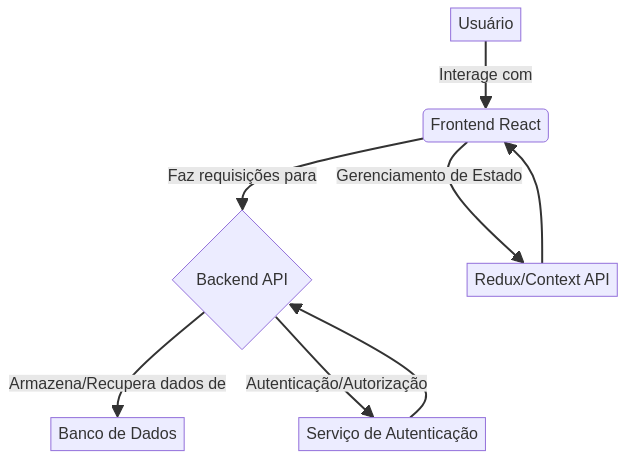

# React Project Manager


## Português

Este é um gerenciador de projetos desenvolvido com React, projetado para oferecer uma interface intuitiva e eficiente para a organização e acompanhamento de tarefas. Ideal para equipes que buscam otimizar seus fluxos de trabalho e gerenciar projetos de forma colaborativa. Este projeto serve como um portfólio profissional, demonstrando habilidades em desenvolvimento front-end com React, gerenciamento de estado, roteamento e integração de componentes.

### Funcionalidades

- **Criação e Gerenciamento de Projetos:** Adicione, edite e remova projetos com facilidade.
- **Gestão de Tarefas:** Crie tarefas dentro de cada projeto, defina prioridades e status.
- **Interface Intuitiva:** Design responsivo e amigável para uma experiência de usuário fluida.
- **Visualização de Progresso:** Acompanhe o status dos projetos e tarefas em tempo real.

### Tecnologias Utilizadas


### Estrutura do Projeto

```
React-Project-Manager/
├── public/
├── src/
│   ├── components/       # Componentes reutilizáveis
│   ├── pages/            # Páginas da aplicação
│   ├── services/         # Lógica de negócio e integração com API
│   ├── assets/           # Imagens, ícones e outros recursos
│   ├── App.js            # Componente principal da aplicação
│   └── index.js          # Ponto de entrada da aplicação
├── tests/                # Testes unitários e de integração
├── docs/                 # Documentação adicional e diagramas
├── config/               # Arquivos de configuração
├── .gitignore
├── package.json
├── README.md
└── LICENSE
```

### Instalação

Para configurar o projeto localmente, siga os passos abaixo:

1. Clone o repositório:
   ```bash
   git clone https://github.com/galafis/React-Project-Manager.git
   cd React-Project-Manager
   ```

2. Instale as dependências:
   ```bash
   npm install
   ```

3. Inicie a aplicação:
   ```bash
   npm start
   ```

   A aplicação estará disponível em `http://localhost:3000`.

### Exemplos de Uso

#### Criando um Novo Projeto

1. Navegue até a página 'Projetos'.
2. Clique no botão 'Adicionar Novo Projeto'.
3. Preencha os detalhes do projeto (nome, descrição, data de início/fim).
4. Salve o projeto.

#### Adicionando uma Nova Tarefa

1. Selecione um projeto existente.
2. Na seção de tarefas, clique em 'Adicionar Tarefa'.
3. Insira o nome da tarefa, descrição, atribua um responsável e defina a prioridade.
4. Salve a tarefa.

### Diagrama de Arquitetura



### Licença

Este projeto está licenciado sob a Licença MIT. Veja o arquivo [LICENSE](LICENSE) para mais detalhes.

### Autor

Desenvolvido por [Gabriel Demetrios Lafis](https://github.com/galafis).

---

## English

This is a project manager developed with React, designed to offer an intuitive and efficient interface for organizing and tracking tasks. Ideal for teams looking to optimize their workflows and manage projects collaboratively. This project serves as a professional portfolio, demonstrating skills in front-end development with React, state management, routing, and component integration.

### Features

- **Project Creation and Management:** Easily add, edit, and remove projects.
- **Task Management:** Create tasks within each project, set priorities, and status.
- **Intuitive Interface:** Responsive and user-friendly design for a fluid user experience.
- **Progress Visualization:** Track project and task status in real-time.

### Technologies Used


### Project Structure

```
React-Project-Manager/
├── public/
├── src/
│   ├── components/       # Reusable components
│   ├── pages/            # Application pages
│   ├── services/         # Business logic and API integration
│   ├── assets/           # Images, icons, and other resources
│   ├── App.js            # Main application component
│   └── index.js          # Application entry point
├── tests/                # Unit and integration tests
├── docs/                 # Additional documentation and diagrams
├── config/               # Configuration files
├── .gitignore
├── package.json
├── README.md
└── LICENSE
```

### Installation

To set up the project locally, follow these steps:

1. Clone the repository:
   ```bash
   git clone https://github.com/galafis/React-Project-Manager.git
   cd React-Project-Manager
   ```

2. Install dependencies:
   ```bash
   npm install
   ```

3. Start the application:
   ```bash
   npm start
   ```

   The application will be available at `http://localhost:3000`.

### Usage Examples

#### Creating a New Project

1. Navigate to the 'Projects' page.
2. Click the 'Add New Project' button.
3. Fill in project details (name, description, start/end date).
4. Save the project.

#### Adding a New Task

1. Select an existing project.
2. In the tasks section, click 'Add Task'.
3. Enter the task name, description, assign a responsible person, and set priority.
4. Save the task.

### Architecture Diagram


### License

This project is licensed under the MIT License. See the [LICENSE](LICENSE) file for more details.

### Author

Developed by [Gabriel Demetrios Lafis](https://github.com/galafis).

